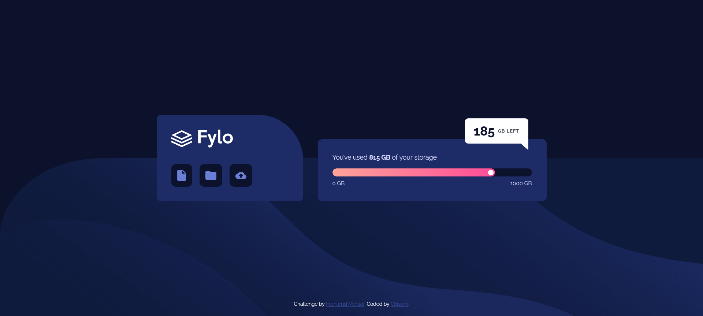
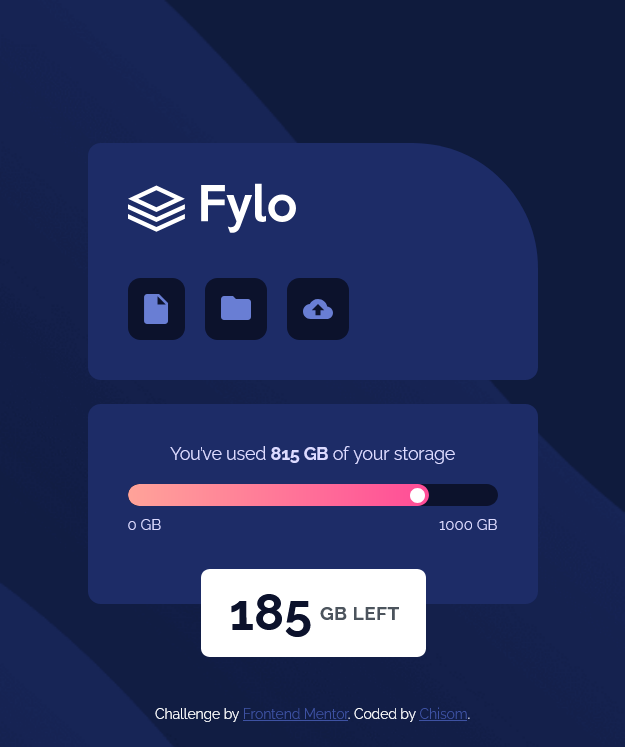

# Frontend Mentor - Fylo data storage component solution

This is a solution to the [Fylo data storage component challenge on Frontend Mentor](https://www.frontendmentor.io/challenges/fylo-data-storage-component-1dZPRbV5n). Frontend Mentor challenges help you improve your coding skills by building realistic projects. 

## Table of contents

- [Overview](#overview)
  - [The challenge](#the-challenge)
  - [Screenshot](#screenshot)
  - [Links](#links)
- [My process](#my-process)
  - [Built with](#built-with)
  - [What I learned](#what-i-learned)
  - [Continued development](#continued-development)
  - [Useful resources](#useful-resources)
  - [AI Collaboration](#ai-collaboration)
- [Author](#author)

## Overview

The Fylo Data Storage Component is a responsive UI component that visually tracks a user’s cloud storage usage. It features:

- A left card with branding and feature icons
- A right card showing storage progress with a custom progress bar and a bubble indicator highlighting remaining storage

The project uses a desktop-first approach: the layout was designed for larger screens first, then media queries were used to adjust the layout for tablets and mobile devices. Key aspects include custom CSS for layout, progress bar styling, bubble positioning, and responsive background images.

### The challenge

Users should be able to:

- View the optimal layout for the site depending on their device's screen size

### Screenshot

### Links

- Solution URL: To be added after Frontend Mentor submission
- Live Site URL: Coming soon

## My process

I started by building the HTML structure with two main cards: left for branding/icons and right for storage tracking.

I then used custom CSS to:
- Style cards, typography, and background images
- Create the progress bar with a bubble indicator showing storage usage
- Position elements using absolute and relative positioning
- Make the layout responsive using a desktop-first workflow with media queries

Key focuses during development:

- Designing pixel-perfect components
- Ensuring responsive background images for desktop and mobile
- AStyling dynamic elements like the progress bar and bubble indicator

### Built with

- Semantic HTML5 markup
- Custom CSS for layout, styling, and responsiveness
- Desktop-first responsive workflow

### What I learned

This project helped me improve my skills in:

- Building responsive layouts using custom CSS
- Styling custom components like progress bars and bubble indicators using CSS
- Handling desktop-first to mobile workflows
- Using absolute and relative positioning effectively

### Continued development

In future projects, I plan to:

- Refine desktop-first responsive design techniques
- Explore more advanced CSS animations for dynamic components
- Practice creating pixel-perfect UI components without frameworks

### Useful resources

- [MDN CSS](https://developer.mozilla.org/en-US/) - Reference for positioning, pseudo-elements, and responsive styling
- [Frontend Mentor](https://www.frontendmentor.io/home) - Design reference and challenge instructions

### AI Collaboration

During this project, I used AI tools to:

- Brainstorm ideas for bubble positioning and progress bar styling
- Get guidance on responsive image handling

## Author

- Github - [Chisom](https://github.com/Chisom07)
- Frontend Mentor - [@Chisom07](https://www.frontendmentor.io/profile/Chisom07)

